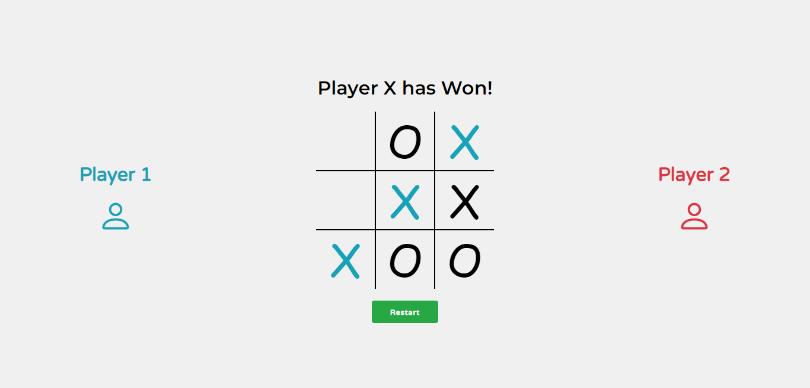

# TicTacToe

> TicTacToe Game (Desktop Display)
---
## Live Demo
[Live Demo Here](https://amen6.github.io/TicTacToe/)

## Description

**TicTacToe** or *Xs and Os* is a very common **game**, where players take turns placing a mark *(X or O)* in one of the cells of the grid. The **goal of the game is** for players to position their marks so that they **make a continuous line of three cells** vertically, horizontally, or diagonally. **The design is also responsive.**

## How To Use

- ### Adding Marks
    Adding a mark **(X or O)** is very simple, you just need to click on the cell where you want your mark to be there. You **can't** add a mark where there is a one already.

- ### Restarting
    To restart the game, just click the `Restart` button under the grid. All the marks will be removed and a new game will start.

---

## Images

- [Desktop Design](images/TicTacToe_Desktop.jpg)

- [Narrow Design](images/TicTacToe_Narrow.jpg)

---